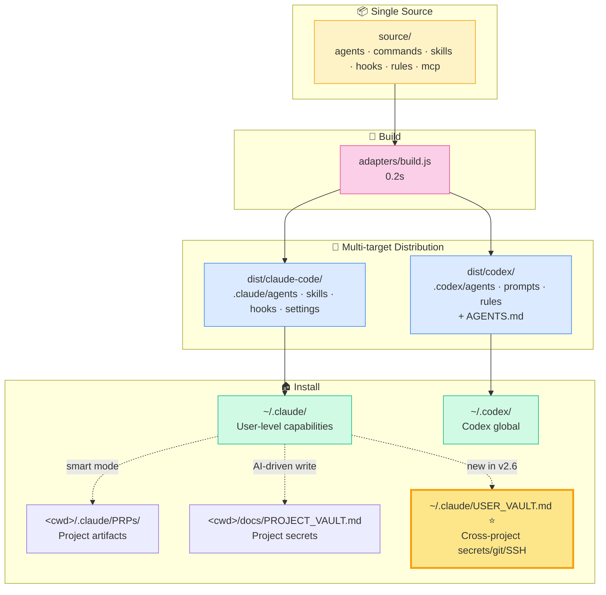
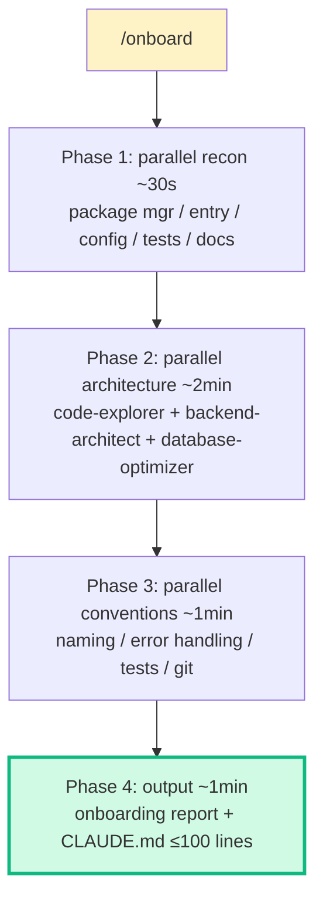

<div align="center">

# MCC

### Multi-target Claude / Codex Configuration

**Install once. AI takes over.** · *装一次，AI 接管。*

Production-grade AI coding config for both Claude Code and Codex  
*为 Claude Code 和 Codex 双目标定制的产品级 AI 协作配置*

[](LICENSE)
[](https://github.com/18811184907/mcc/releases)
[](https://github.com/18811184907/mcc/stargazers)


**[⚡ Quick Start](#-quick-start) · [✨ Features](#-what-you-get) · [🇨🇳 中文](./README.md) · [📖 Docs](./USAGE.md) · [📜 Changelog](./CHANGELOG.md)**

</div>

---

## 🎯 30-Second Pitch

> **Tell Claude one sentence. It does the rest.** Say "OPENAI_API_KEY is sk-xxx" → Claude auto-writes vault, syncs `.env`, updates `.gitignore`. Say "I just cloned a 50k LOC project" → Claude runs 4-phase parallel scan, outputs onboarding report. Say "deploy to 192.168.1.10" → Claude auto-writes SSH config + secrets-index.

> **Zero template-copying. Zero manual `.env` editing. Zero repetitive setup.**

```mermaid
graph LR
    A[You say one sentence] --> B{Claude detects scenario}
    B -->|secret-related| C[user-vault / project-vault skill]
    B -->|large codebase| D[/onboard 4-phase scan]
    B -->|new feature| E[/prd → /plan → /implement → /pr]
    B -->|stuck| F[/fix-bug 4-domain triage]
    C --> G[Hook auto-syncs to .env / SSH / git]
    D --> H[~5min onboarding report + CLAUDE.md]
    E --> I[6-stage gate per step]
    F --> J[Root cause + archive to docs/mistakes/]
    style A fill:#fef3c7,stroke:#f59e0b
    style G fill:#d1fae5,stroke:#10b981
    style H fill:#d1fae5,stroke:#10b981
    style I fill:#d1fae5,stroke:#10b981
    style J fill:#d1fae5,stroke:#10b981
```

---

## ⚡ Quick Start

### One command (Windows / macOS / Linux)

<table>
<tr>
<th>Windows (PowerShell)</th>
<th>macOS / Linux / Git Bash</th>
</tr>
<tr>
<td>

```powershell
iwr -useb https://raw.githubusercontent.com/18811184907/mcc/main/bootstrap.ps1 | iex
```

</td>
<td>

```bash
curl -fsSL https://raw.githubusercontent.com/18811184907/mcc/main/bootstrap.sh | bash
```

</td>
</tr>
</table>

> **Prerequisites**: Node.js ≥ 16 · Claude Code or Codex (either one)  
> **Restart Claude Code** to activate

### Verify

In Claude Code, send:

```
/mcc-help
```

If you see MCC navigation = installed.

### Try it now

In a chat with Claude, just say:

```
My OPENAI_API_KEY is sk-xxx
```

Claude will automatically:
1. ✓ Check / create `~/.claude/USER_VAULT.md`
2. ✓ Add your key
3. ✓ Trigger hook to sync to `~/.claude/.user-env.sh` + `.user-env.ps1`
4. ✓ Auto-append `source` line to your `~/.bashrc` / PowerShell `$PROFILE`
5. ✓ Brief confirmation: "Added OPENAI_API_KEY, all projects can now use process.env.OPENAI_API_KEY"

**You only typed one English (or Chinese) sentence.**

---

## ✨ What you get

<table>
<tr>
<td width="50%" valign="top">

### 🤖 19 domain agents

planner · code-reviewer · debugger · security-reviewer · ai-engineer · python-pro · typescript-pro · fastapi-pro · frontend-developer · backend-architect · database-optimizer · performance-engineer · prompt-engineer · vector-database-engineer · refactor-cleaner · silent-failure-hunter · test-automator · code-explorer · javascript-pro

</td>
<td width="50%" valign="top">

### ⚙️ 15 slash commands

**PRP pipeline**: `/prd` → `/plan` → `/implement` → `/pr`  
**Review**: `/review` (parallel reviewer + security)  
**Fix**: `/fix-bug` (4-domain triage: bug / build / perf / deploy)  
**Session**: `/session-save` `/session-resume`  
**Onboard**: `/onboard` (4-phase scan) · `/index-repo`  
**Nav**: `/mcc-help` · `/explain`

</td>
</tr>
<tr>
<td width="50%" valign="top">

### 🧠 23 skills

**Orchestration (4)**: orchestration-playbook / help / dispatching-parallel-agents / party-mode  
**Workflow (6)**: confidence-check / tdd-workflow / verification-loop / code-review-workflow / subagent-driven-development / continuous-learning-v2  
**Vault (3)** ⭐ v2.6: project-vault · **user-vault** (cross-project) · claudemd-sync  
**Specialty (10)**: e2e-testing · architecture-decision-records · database-schema-doc · project-onboarding · etc.

</td>
<td width="50%" valign="top">

### 🪝 29 hooks + 5 MCP servers

**Hooks**: pre-vault-leak-detect · post-vault-sync · post-user-vault-sync · post-claudemd-sync · session-start · gateguard etc.  
**MCP**: Serena (semantic memory) · Context7 (live docs) · GitHub · Sequential (deep reasoning) · Playwright

</td>
</tr>
</table>

---

## 🏗️ Architecture



**Key design**:
- 📦 **Single source of truth**: `source/` is the only thing you edit
- 🔧 **Zero-dep build**: `adapters/` are pure Node scripts (no npm), 0.2s build
- 🎯 **Dual-target**: Claude Code (full hook + skill) + Codex (hooks → soft conventions, skills → AGENTS.md sections)
- 🏠 **Smart-split**: capabilities live in `~/.claude/` (shared across projects), artifacts in your project

---

## 🚀 5 typical scenarios

### 1️⃣ New feature: PRP pipeline

```mermaid
graph LR
    A[/prd] -->|7-phase Socratic| B[PRD]
    B --> C[/plan]
    C -->|extract patterns + mandatory reading| D[Self-contained plan]
    D --> E[/implement]
    E -->|6-stage gate per step| F[Implementation]
    F --> G[/review]
    G -->|parallel reviewer + security| H[Review report]
    H --> I[/pr]
    I -->|link artifacts| J[GitHub PR]
    style A fill:#dbeafe
    style C fill:#dbeafe
    style E fill:#dbeafe
    style G fill:#dbeafe
    style I fill:#dbeafe
```

All artifacts land in `.claude/PRPs/{prds,plans,reports,reviews}/`. Next session, `/session-resume` picks up exactly where you left off.

### 2️⃣ Onboard a legacy codebase: 4-phase parallel scan

Just cloned a 50k-LOC unfamiliar project? Run `/onboard`:



**~5 min report** with stack / entry points / data flow / team conventions / red flags / first-step recommendations.

### 3️⃣ Bug triage: 4-domain + forced root cause

```
/fix-bug "Login API returns 500 intermittently"
```

Parallel blind-diagnosis: debugger + performance-engineer + database-optimizer. **No band-aids allowed**, mandatory root cause analysis. Findings archived to `docs/mistakes/`.

### 4️⃣ Cross-project secret management (⭐ v2.6 flagship)

```
You say: "My OPENAI_API_KEY is sk-xxx"
        ↓
Claude judges: cross-project → USER_VAULT
        ↓
Writes ~/.claude/USER_VAULT.md
        ↓
Hook auto-triggers:
  ├─ ~/.claude/.user-env.sh         (Bash/Zsh auto-source)
  ├─ ~/.claude/.user-env.ps1        (PowerShell auto-dot-source)
  ├─ ~/.ssh/config (MCC-User block) (SSH host injection)
  └─ git config --global            (GIT_USER_* special keys)
        ↓
Append source line to ~/.bashrc / $PROFILE (idempotent)
        ↓
✓ All projects' code can use process.env.OPENAI_API_KEY immediately
```

Complements PROJECT_VAULT: this-project DB password → project vault; cross-project personal key → user vault. Claude asks if unsure.

### 5️⃣ Resume yesterday's work

```
End of day:    /session-save
Next morning:  /session-resume
               → Loads what was done / what failed / next exact action
```

---

## 🎓 Philosophy

> **Less commands, more automation**  
> **AI-driven, minimal user input**  
> **Evidence > assumptions** · **Code > documentation** · **Efficiency > verbosity**

See top of `rules/common/mcc-principles.md` for the 3 meta-rules.

---

## 📦 Install Details

### 3 scopes (default: smart)

| Scope | Install to | For |
|---|---|---|
| **smart** (default) | `~/.claude/` + `~/.codex/` full + `<cwd>/.claude/PRPs/` artifacts | 99% personal devs |
| **global** | User-level only, doesn't touch cwd | Running in `$HOME` / don't pollute cwd |
| **project** (team) | Full install to `<cwd>/.claude/` + `<cwd>/.codex/` + `AGENTS.md` in git | Team lead pushing to whole team |

Switch: `MCC_BOOTSTRAP_ARGS="--scope project" iwr/curl ... | iex/bash`

Detailed flags (`--strict` / `--skip-claudemd` / `--exclusive` etc.) in [INSTALL.md](./INSTALL.md).

### Uninstall

```powershell
# Windows
.\uninstall.ps1
.\uninstall.ps1 -Timestamp 2026-04-29-075916  # restore from specific timestamp
```

```bash
# Unix
./uninstall.sh
./uninstall.sh --timestamp 2026-04-29-075916
```

**Preserves** your PRPs / session-data / learned skills / mistakes / ADR.

---

## 📚 Documentation

| File | Content |
|---|---|
| [USAGE.md](./USAGE.md) | Full reference for 15 commands |
| [INSTALL.md](./INSTALL.md) | Install flags + troubleshooting |
| [ARCHITECTURE.md](./ARCHITECTURE.md) | source/adapters/dist 3-layer + dual-target translation details |
| [QUICKSTART.md](./QUICKSTART.md) | Quick start guide |
| [CHANGELOG.md](./CHANGELOG.md) | Version history |
| [README.md](./README.md) | 中文版 |

---

## 🙏 Credits

Distilled from these 5 MIT projects (**not just stitched together**—everything was rewritten for production):

| Project | Contribution |
|---|---|
| [affaan-m/everything-claude-code](https://github.com/affaan-m/everything-claude-code) | 4-phase onboarding design |
| [SuperClaude-Org/SuperClaude_Framework](https://github.com/SuperClaude-Org/SuperClaude_Framework) | `/index-repo` token-saving strategy |
| [wshobson/agents](https://github.com/wshobson/agents) | Multi-dim parallel scanning |
| [bmad-code-org/BMAD-METHOD](https://github.com/bmad-code-org/BMAD-METHOD) | Role-based agent design |
| [obra/superpowers](https://github.com/obra/superpowers) | 8 unique skills (subagent-driven-development / tdd-workflow etc.) |

---

## 🤝 Contributing

- Read [ARCHITECTURE.md](./ARCHITECTURE.md) before issue/PR
- **Edit only `source/`**, never `dist/` (gets overwritten by build)
- Run `node adapters/build.js` to verify build
- Run `node tests/installer-dry-run.js` to verify installer
- PR / commit / release notes default to Chinese (matching repo history)

---

## 📄 License

MIT. See [LICENSE](./LICENSE).

---

<div align="center">

**[⬆ Back to top](#mcc)** · **[🇨🇳 中文](./README.md)** · **[⭐ Star on GitHub](https://github.com/18811184907/mcc)**

Made with ❤️ for AI-driven coding workflows

</div>
