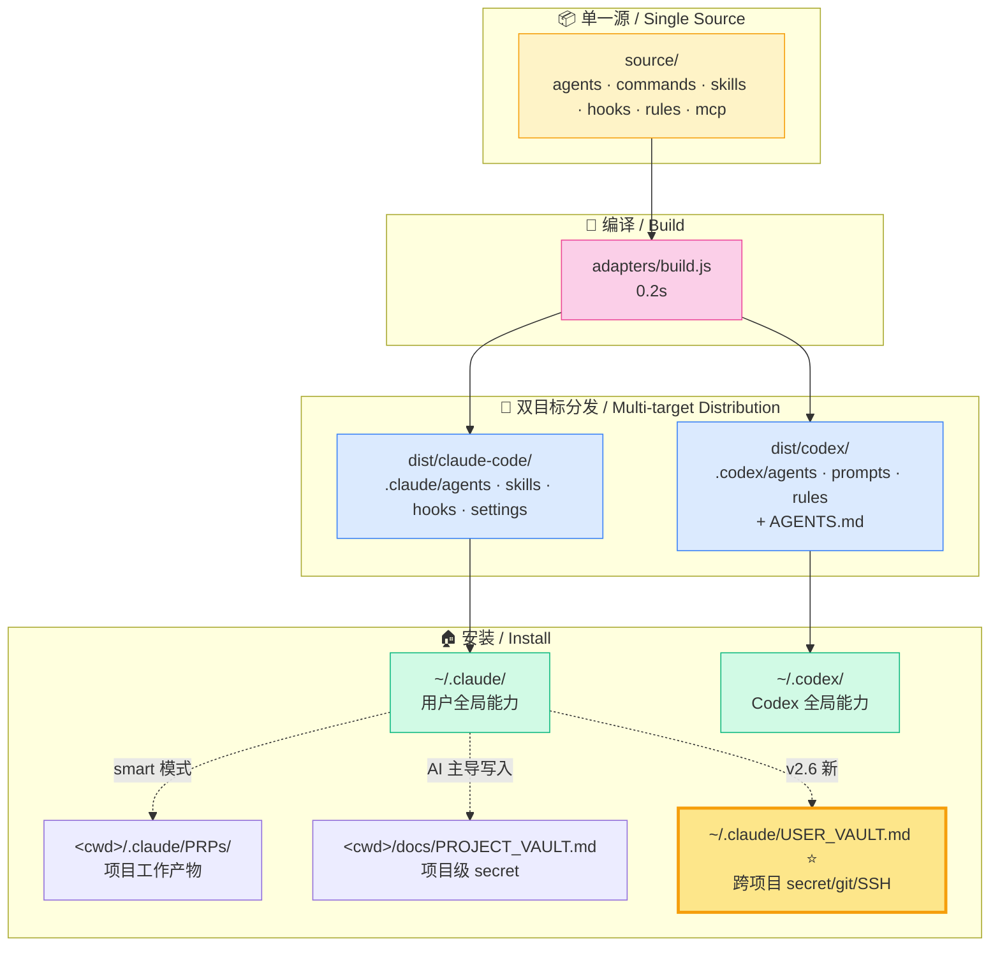
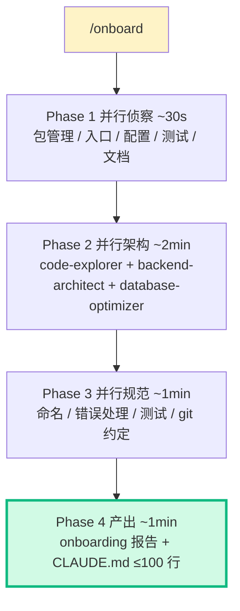

<div align="center">

# MCC

### Multi-target Claude / Codex Configuration

**装一次，AI 接管。** · *Install once. AI takes over.*

为 Claude Code 和 Codex 双目标定制的产品级 AI 协作配置  
*Production-grade AI coding config for both Claude Code and Codex*

[](LICENSE)
[](https://github.com/18811184907/mcc/releases)
[](https://github.com/18811184907/mcc/stargazers)


**[⚡ Quick Start](#-quick-start) · [✨ Features](#-你会拥有--what-you-get) · [🌐 English](./README.en.md) · [📖 Docs](./USAGE.md) · [📜 Changelog](./CHANGELOG.md)**

</div>

---

## 🎯 30 秒看懂

> **你说一句话，Claude 帮你做完。** 你说 "OPENAI_API_KEY 是 sk-xxx"，Claude 自动写 vault、同步 .env、更新 .gitignore；你说 "我刚 clone 一个老项目"，Claude 自动 4 阶段并行扫架构出报告；你说 "这次部署到 192.168.1.10"，Claude 自动写 SSH config + secrets-index。

> **零拷模板、零手编 .env、零重复劳动。**

```mermaid
graph LR
    A[你说一句话] --> B{Claude 判断场景}
    B -->|secret 类| C[user-vault / project-vault skill]
    B -->|大代码库| D[/onboard 4 阶段扫]
    B -->|新功能| E[/prd → /plan → /implement → /pr]
    B -->|卡住了| F[/fix-bug 4 域分诊]
    C --> G[hook 自动 sync 到 .env / SSH / git]
    D --> H[5min 出 onboarding 报告 + CLAUDE.md]
    E --> I[每步 6 阶段验证闸门]
    F --> J[根因分析 + 归档 docs/mistakes/]
    style A fill:#fef3c7,stroke:#f59e0b
    style G fill:#d1fae5,stroke:#10b981
    style H fill:#d1fae5,stroke:#10b981
    style I fill:#d1fae5,stroke:#10b981
    style J fill:#d1fae5,stroke:#10b981
```

---

## ⚡ Quick Start

### 一条命令装好（Windows / macOS / Linux）

<table>
<tr>
<th>Windows (PowerShell)</th>
<th>macOS / Linux / Git Bash</th>
</tr>
<tr>
<td>

```powershell
iwr -useb https://raw.githubusercontent.com/18811184907/mcc/main/bootstrap.ps1 | iex
```

</td>
<td>

```bash
curl -fsSL https://raw.githubusercontent.com/18811184907/mcc/main/bootstrap.sh | bash
```

</td>
</tr>
</table>

> **前置 / Prerequisites**：Node.js ≥ 16 · Claude Code 或 Codex 任一  
> **重启 Claude Code 立即生效** · **Restart Claude Code to activate**

### 验证装好了

在 Claude Code 里打：

```
/mcc-help
```

看到 MCC 导航 = 成功。

### 立刻试一下（Try it）

在对话里跟 Claude 说一句：

```
我的 OPENAI_API_KEY 是 sk-xxx
```

Claude 会自动：
1. ✓ 检查 / 创建 `~/.claude/USER_VAULT.md`
2. ✓ 加你的 key 进去
3. ✓ 触发 hook 同步到 `~/.claude/.user-env.sh` + `.user-env.ps1`
4. ✓ 自动加 `source` 行到你的 `~/.bashrc` / PowerShell `$PROFILE`
5. ✓ 简短确认："已加 OPENAI_API_KEY，所有项目都能用 process.env.OPENAI_API_KEY"

**整个过程你只敲了一句中文。**

---

## ✨ 你会拥有 / What you get

<table>
<tr>
<td width="50%" valign="top">

### 🤖 19 个领域 agent

planner · code-reviewer · debugger · security-reviewer · ai-engineer · python-pro · typescript-pro · fastapi-pro · frontend-developer · backend-architect · database-optimizer · performance-engineer · prompt-engineer · vector-database-engineer · refactor-cleaner · silent-failure-hunter · test-automator · code-explorer · javascript-pro

</td>
<td width="50%" valign="top">

### ⚙️ 15 个 slash 命令

**PRP 流水线**：`/prd` → `/plan` → `/implement` → `/pr`  
**审查**：`/review`（并行 reviewer + security）  
**修复**：`/fix-bug`（4 域分诊：bug / build / perf / deploy）  
**会话**：`/session-save` `/session-resume`  
**入门**：`/onboard`（4 阶段扫老项目）· `/index-repo`  
**导航**：`/mcc-help` · `/explain`（中文讲解）

</td>
</tr>
<tr>
<td width="50%" valign="top">

### 🧠 23 个 skill

**编排（4）**: orchestration-playbook / help / dispatching-parallel-agents / party-mode  
**工作流（6）**: confidence-check / tdd-workflow / verification-loop / code-review-workflow / subagent-driven-development / continuous-learning-v2  
**Vault（3）** ⭐ v2.6: project-vault · **user-vault**（跨项目通用）· claudemd-sync  
**专项（10）**: 含 e2e-testing · architecture-decision-records · database-schema-doc · project-onboarding 等

</td>
<td width="50%" valign="top">

### 🪝 29 个 hook + 5 MCP

**Hooks**: pre-vault-leak-detect · post-vault-sync · post-user-vault-sync · post-claudemd-sync · session-start · gateguard 等  
**MCP**: Serena（语义记忆）· Context7（实时文档）· GitHub · Sequential（深推理）· Playwright

</td>
</tr>
</table>

---

## 🏗️ 架构 / Architecture



**关键设计**：
- 📦 **一份真相** ：`source/` 是唯一源，所有改动都在这里
- 🔧 **零依赖编译**：`adapters/` 纯 Node 脚本，无 npm 依赖，0.2 秒构建
- 🎯 **dual-target**：Claude Code（hook + skill 都支持）+ Codex（hook 转软约定，skill 转 AGENTS.md 段落）
- 🏠 **smart-split**：能力装 `~/.claude/`（永久共享），工作产物建在项目里

---

## 🚀 5 大典型场景

### 1️⃣ 新功能：PRP 流水线

```mermaid
graph LR
    A[/prd] -->|7 phase 苏格拉底| B[PRD]
    B --> C[/plan]
    C -->|抓代码模式 + mandatory reading| D[自包含计划]
    D --> E[/implement]
    E -->|每步 6 阶段验证| F[实现]
    F --> G[/review]
    G -->|并行 reviewer + security| H[review report]
    H --> I[/pr]
    I -->|关联 artifacts| J[GitHub PR]
    style A fill:#dbeafe
    style C fill:#dbeafe
    style E fill:#dbeafe
    style G fill:#dbeafe
    style I fill:#dbeafe
```

artifacts 全部落 `.claude/PRPs/{prds,plans,reports,reviews}/`，下次 session `/session-resume` 秒接。

### 2️⃣ 接手老项目：4 阶段并行扫

刚 clone 一个 50k 行的陌生项目？敲 `/onboard`：



**~5 分钟出报告**，含栈/入口/数据流/团队约定/危险信号/接手第一步建议。

### 3️⃣ Bug 定位：4 域分诊 + 根因强制

```
/fix-bug "登录接口偶尔 500"
```

并行盲诊：debugger + performance-engineer + database-optimizer，**禁止打补丁，强制根因分析**，产出归档到 `docs/mistakes/`。

### 4️⃣ 跨项目 secret 管理（⭐ v2.6 旗舰）

```
你说: "我的 OPENAI_API_KEY 是 sk-xxx"
        ↓
Claude 判断: 跨项目 → USER_VAULT
        ↓
写 ~/.claude/USER_VAULT.md
        ↓
Hook 自动触发:
  ├─ ~/.claude/.user-env.sh         (Bash/Zsh 自动 source)
  ├─ ~/.claude/.user-env.ps1        (PowerShell 自动 dot-source)
  ├─ ~/.ssh/config (MCC-User 块)    (SSH 主机注入)
  └─ git config --global            (GIT_USER_* 特殊 key)
        ↓
追加 source 行到 ~/.bashrc / $PROFILE (idempotent)
        ↓
✓ 所有项目代码 process.env.OPENAI_API_KEY 即时可用
```

跟 PROJECT_VAULT 互补：本项目 DB 密码写项目里，跨项目 personal key 写用户级。Claude 判断不准时主动问。

### 5️⃣ 跨天继续

```
昨天结束: /session-save
今天:    /session-resume
         → 加载昨天做到哪 / 什么没跑通 / 下一步 exact action
```

---

## 🎓 Philosophy

> **少命令，多自动 / Less commands, more automation**  
> **AI 主导，用户少敲 / AI-driven, minimal user input**  
> **Evidence > assumptions** · **Code > documentation** · **Efficiency > verbosity**

详见 `rules/common/mcc-principles.md` 顶部三条元规则。

---

## 📦 安装详情 / Install Details

### 三种 scope（默认 smart）

| Scope | 装到哪 / Install to | 适合谁 / For |
|---|---|---|
| **smart**（默认） | `~/.claude/` + `~/.codex/` 全套 + `<cwd>/.claude/PRPs/` 工作产物 | 99% 个人开发者 / Personal devs |
| **global** | 只装用户级，不动当前目录 | 在 `$HOME` 跑 / 不污染 cwd |
| **project**（team） | 全套到 `<cwd>/.claude/` + `<cwd>/.codex/` + `AGENTS.md` 进 git | 团队 lead 推给全队 |

切换：`MCC_BOOTSTRAP_ARGS="--scope project" iwr/curl ... | iex/bash`

详细 flag（`--strict` / `--skip-claudemd` / `--exclusive` 等）见 [INSTALL.md](./INSTALL.md)

### 卸载

```powershell
# Windows
.\uninstall.ps1
.\uninstall.ps1 -Timestamp 2026-04-29-075916  # 指定时间戳恢复
```

```bash
# Unix
./uninstall.sh
./uninstall.sh --timestamp 2026-04-29-075916
```

会**保留**你的 PRPs / session-data / learned skills / mistakes / ADR。

---

## 📚 文档 / Documentation

| 文件 | 内容 |
|---|---|
| [USAGE.md](./USAGE.md) | 15 个命令完整速查 |
| [INSTALL.md](./INSTALL.md) | 安装 flag 详解 + 故障排查 |
| [ARCHITECTURE.md](./ARCHITECTURE.md) | source/adapters/dist 三层 + 双目标转译细节 |
| [QUICKSTART.md](./QUICKSTART.md) | 快速上手 |
| [CHANGELOG.md](./CHANGELOG.md) | 版本变更日志 |
| [README.en.md](./README.en.md) | English version |

---

## 🙏 致谢 / Credits

融合了以下 5 个 MIT 项目精华（**不是简单拼接**——都做了产品级融合改写）：

| 项目 | 贡献 |
|---|---|
| [affaan-m/everything-claude-code](https://github.com/affaan-m/everything-claude-code) | 4 阶段 onboarding 设计 |
| [SuperClaude-Org/SuperClaude_Framework](https://github.com/SuperClaude-Org/SuperClaude_Framework) | `/index-repo` token 节省策略 |
| [wshobson/agents](https://github.com/wshobson/agents) | 多维并行扫描 |
| [bmad-code-org/BMAD-METHOD](https://github.com/bmad-code-org/BMAD-METHOD) | 角色 agent 设计 |
| [obra/superpowers](https://github.com/obra/superpowers) | 8 个独家 skill（subagent-driven-development / tdd-workflow 等） |

---

## 🤝 贡献 / Contributing

- 提 issue / PR 前先看 [ARCHITECTURE.md](./ARCHITECTURE.md)
- 改 agent/command/skill **只改 `source/`**，不要直接改 `dist/`（会被 build 覆盖）
- 跑 `node adapters/build.js` 验证产出
- 跑 `node tests/installer-dry-run.js` 验证 installer
- PR / commit / release notes 默认中文（跟仓库历史一致）

---

## 📄 License

MIT. 详见 [LICENSE](./LICENSE)。

---

<div align="center">

**[⬆ 回到顶部](#mcc)** · **[🌐 English](./README.en.md)** · **[⭐ Star on GitHub](https://github.com/18811184907/mcc)**

Made with ❤️ for AI-driven coding workflows

</div>
