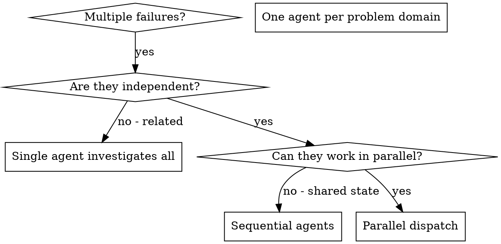

# Dispatching Parallel Agents

## 概述

你把 task 交给**上下文隔离**的 specialized agent。通过精心构造 instruction 和 context，让他们聚焦、成功。他们**不应继承**你会话的历史——你精确构造他们所需的一切。这也保留你自己的 context 用于协调。

当你有**多个无关的失败**（不同测试文件、不同子系统、不同 bug），顺序调查是浪费时间。每次调查都独立，可以**并行**。

**核心原则：** 每个独立问题域派一个 agent，让他们并发工作。

## Auto-Dispatch 决策树（每次接手任务先跑一遍）

这是 MCC v1.7 的核心升级：**并行默认发生，不等用户提**。每次接手任务前 5 秒自问这 4 个问题：

```
Q1. 任务能拆成 2+ 个互不依赖的子任务吗？
  YES → 并行派发（走下面"场景 → agent 组合"表）
  NO  → 跳 Q2

Q2. 有多个专家视角会给不同建议吗？（比如技术选型 / 架构决策 / 性能 vs 安全权衡）
  YES → 走 party-mode skill 辩论式并行
  NO  → 跳 Q3

Q3. 任务是串行但每步依赖前一步？
  YES → 走 subagent-driven-development（串行 task 链）
  NO  → 跳 Q4

Q4. 任务很小（<30 行改动）？
  YES → 直接做，不派 agent
  NO  → 派单 agent（比派多 agent 整合简单）
```

## 场景 → Agent 组合速查表（熟记）

| 场景 | 并行派（同一条 message） | 典型耗时 |
|---|---|---|
| **全面代码审查** | `code-reviewer` + `security-reviewer` + `silent-failure-hunter` + `performance-engineer` | 各 1-2 min，总 ~2 min |
| **快速 PR 审查** | `code-reviewer` + `security-reviewer` | ~1 min |
| **Bug 盲诊**（不确定类型） | `debugger` + `performance-engineer` | ~2 min |
| **Bug 盲诊**（涉及数据） | `debugger` + `performance-engineer` + `database-optimizer` | ~2-3 min |
| **前端问题**（UI 还是性能） | `frontend-developer` + `performance-engineer` | ~2 min |
| **新功能规划**（后端栈） | `planner` + `backend-architect` + `database-optimizer` | ~3 min |
| **新功能规划**（AI 栈） | `planner` + `ai-engineer` + `prompt-engineer` + `vector-database-engineer` | ~3 min |
| **新功能规划**（全栈） | `planner` + `backend-architect` + `frontend-developer` | ~3 min |
| **多测试文件失败** | 每个失败文件派 1 个 `debugger` | 各 1-2 min |
| **多模块重构** | 每个模块派 1 个 `refactor-cleaner` | 各 2-3 min |

### 用户意图 → 组合快速映射

```
用户说"审代码 / review"       → code-reviewer + security-reviewer（并行）
用户说"全面体检 / 深度审"      → 加上 silent-failure-hunter + performance-engineer
用户说"bug / 报错 / 慢"        → debugger + performance-engineer（盲诊）
用户说"做个 xxx 功能"          → planner + 对应栈 domain agent
用户说"两个方案选哪个"         → party-mode（辩论）
用户说"并行处理这些"           → 直接按独立度拆分
```

## 何时使用



**使用条件：**
- 3+ 测试文件失败，根因不同
- 多个子系统独立坏掉
- 每个问题可以**不看其它**就独立理解
- 调查之间没有共享状态

**不要用于：**
- 失败是相关的（修一个可能修好另一个）
- 需要理解完整系统状态
- Agent 之间会互相干扰（改同一文件、用同一资源）

## 模式

### 1. 识别独立问题域

按**坏的是什么**分组：
- 文件 A 测试：tool approval 流
- 文件 B 测试：batch completion 行为
- 文件 C 测试：abort 功能

每个域都独立 —— 修 tool approval 不影响 abort 测试。

### 2. 建聚焦的 agent task

每个 agent 拿到：
- **具体 scope：** 一个测试文件或子系统
- **清晰目标：** 让这些测试通过
- **约束：** 不要改其它代码
- **预期输出：** 你发现了什么、修了什么的摘要

### 3. 并行派发

在**同一条 message** 里放全部 Task 调用 —— 这才真正并行：

```typescript
// 同一条 assistant message 里
Task("Fix agent-tool-abort.test.ts failures")
Task("Fix batch-completion-behavior.test.ts failures")
Task("Fix tool-approval-race-conditions.test.ts failures")
// 三个并发跑
```

### 4. 整合回收

Agent 都回来后：
- 读每个 summary
- 确认修改不冲突
- 跑完整测试套
- 整合所有改动

## Agent Prompt 结构

好 prompt 要：
1. **聚焦** —— 一个清晰的问题域
2. **自包含** —— 理解问题所需的所有 context
3. **明确输出** —— 希望 agent 返回什么

```markdown
Fix the 3 failing tests in src/agents/agent-tool-abort.test.ts:

1. "should abort tool with partial output capture" - expects 'interrupted at' in message
2. "should handle mixed completed and aborted tools" - fast tool aborted instead of completed
3. "should properly track pendingToolCount" - expects 3 results but gets 0

These are timing/race condition issues. Your task:

1. Read the test file and understand what each test verifies
2. Identify root cause - timing issues or actual bugs?
3. Fix by:
   - Replacing arbitrary timeouts with event-based waiting
   - Fixing bugs in abort implementation if found
   - Adjusting test expectations if testing changed behavior

Do NOT just increase timeouts - find the real issue.

Return: Summary of what you found and what you fixed.
```

## 常见错误

**❌ 太宽：** "Fix all the tests" —— agent 会迷路
**✅ 具体：** "Fix agent-tool-abort.test.ts" —— 范围聚焦

**❌ 无上下文：** "Fix the race condition" —— agent 不知道在哪
**✅ 有上下文：** 贴错误信息和 test 名

**❌ 无约束：** Agent 可能重构一切
**✅ 有约束：** "Do NOT change production code" 或 "Fix tests only"

**❌ 输出模糊：** "Fix it" —— 你不知道改了什么
**✅ 输出具体：** "Return summary of root cause and changes"

## 何时**不要**用

**相关的失败：** 修一个可能修另一个 —— 先合并调查
**需要完整上下文：** 理解必须看整个系统
**探索性调试：** 还没定位到"坏的是什么"
**共享状态：** Agent 会互相干扰（编辑同一文件、用同一资源）

## 真实示例

**场景：** 大重构后 3 个文件里 6 个测试失败

**失败：**
- agent-tool-abort.test.ts：3 个失败（timing 问题）
- batch-completion-behavior.test.ts：2 个失败（tool 没执行）
- tool-approval-race-conditions.test.ts：1 个失败（execution count = 0）

**决策：** 独立问题域 —— abort 逻辑 / batch completion / race condition 三块分开

**派发：**
```
Agent 1 → Fix agent-tool-abort.test.ts
Agent 2 → Fix batch-completion-behavior.test.ts
Agent 3 → Fix tool-approval-race-conditions.test.ts
```

**结果：**
- Agent 1：把 timeout 换成 event-based waiting
- Agent 2：修 event 结构 bug（threadId 放错位置）
- Agent 3：加"等异步 tool 执行完成"

**整合：** 修改独立、无冲突、全套绿。

**节省时间：** 3 个问题**并行**解决，而不是顺序。

## 关键收益

1. **并行** —— 多个调查同时进行
2. **聚焦** —— 每个 agent 范围窄、跟踪的 context 少
3. **独立** —— agent 之间互不干扰
4. **快** —— 3 个问题在 1 个的时间内解决

## 验证

Agent 返回后：
1. **读每个 summary** —— 理解改了什么
2. **检查冲突** —— agent 编辑了同一段代码？
3. **跑完整测试套** —— 所有修复协同 work
4. **抽查** —— agent 可能犯系统性错误

## 与 MCC 生态的配合

- **与 `party-mode` skill 的分工：**
  - `party-mode` —— **辩论式**：同一个问题让多个 agent 从不同角度给**意见**，orchestrator 呈现各家分歧让人类决策（产出：观点）
  - 本 skill —— **分发式**：多个**独立问题**分给多个 agent 去**解决**（产出：fix）
  - 一个问题分 3 角度辩论 → party-mode；3 个独立问题并行解决 → 本 skill
- **与 `subagent-driven-development` 的区别：**
  - `subagent-driven-development` —— 按 plan 的 task 顺序派发，一个 task 结束再下一个（串行，task 之间可能依赖）
  - 本 skill —— 多个**真独立**问题域并行派发
- **常配合的 agent：**
  - `debugger` —— 每个子问题派一个 debugger 并行定位
  - `code-reviewer` —— 多模块并行 review 时每个模块一个
  - `build-error-resolver` —— 多子系统独立编译报错时
- **不要在 implementation task 之间并行：** 多个 implementer subagent 编辑同仓库会冲突（`subagent-driven-development` 明确禁止），这是本 skill 的"共享状态"红线
