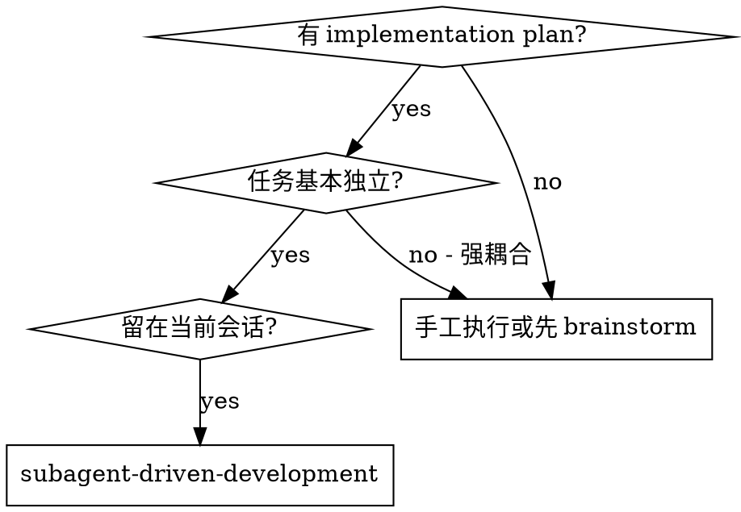
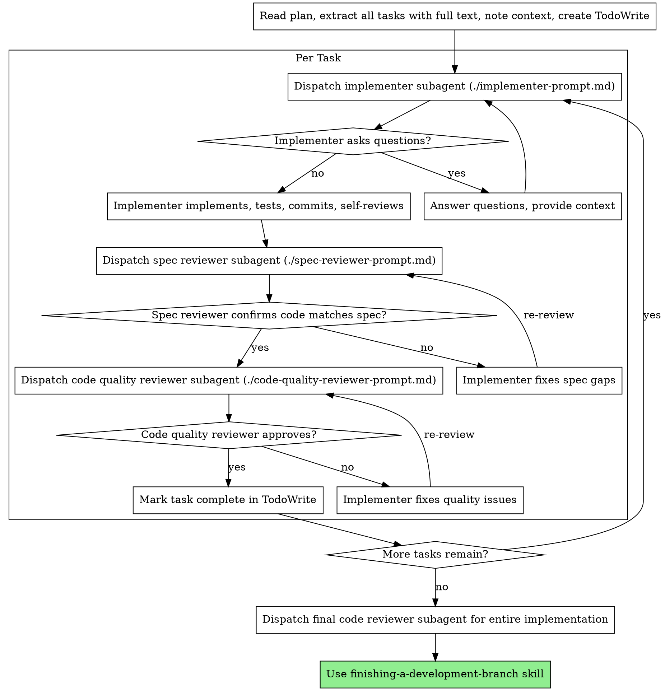

# Subagent-Driven Development

在**当前会话**里执行 implementation plan：每个 task 都派一个**全新的 subagent** 去实现，完成后依次过两道 review——先 spec compliance（做的是不是要求的），再 code quality（做得好不好）。

**为什么用 subagent：** 你把 task 交给**上下文隔离**的 specialized agent。通过精心构造他们收到的 instruction 和 context，你保证他们聚焦、成功。他们**不应该**继承你会话的历史——你精确构造他们所需的一切。这也保留了你自己的 context 用于协调。

**核心原则：** 每 task 一个新 subagent + 两阶段 review（先 spec 后 quality）= 高质量 + 快速迭代

## 何时使用



**vs 手工执行的区别：**
- 同会话（无需切换）
- 每 task 新 subagent（无 context 污染）
- 每 task 两阶段 review：先 spec compliance，再 code quality
- 快速迭代（task 之间无需人工介入）

## 流程



## 模型选择

**能用更便宜的模型处理，就别用贵的**——省钱又提速。

- **机械实现任务**（独立函数、spec 清晰、1-2 个文件）：用便宜快的模型。plan 写得好时大多数实现任务都是机械的。
- **集成与判断任务**（多文件协调、模式匹配、调试）：用标准模型。
- **架构、设计、review 任务**：用最强的可用模型。

**复杂度信号：**
- 动 1-2 个文件 + spec 完整 → cheap model
- 跨多个文件、需集成考量 → standard model
- 需要设计判断或广泛的代码库理解 → 最强模型

## 处理 Implementer 的四种状态

Implementer subagent 回报四种状态之一，分别对应：

**DONE：** 进入 spec compliance review。

**DONE_WITH_CONCERNS：** implementer 完成了但自己有疑虑。先读疑虑内容。如果疑虑涉及正确性或范围，先处理再 review。如果只是观察（比如"这文件越来越大了"），记录一下继续 review。

**NEEDS_CONTEXT：** implementer 缺信息。补上 context 重新 dispatch。

**BLOCKED：** 卡住了。评估阻碍：
1. 上下文问题 → 补 context，用同模型重新 dispatch
2. 需要更深推理 → 换更强模型重新 dispatch
3. 任务太大 → 拆小
4. plan 本身错了 → 升级给人类决策

**永远不要**忽略升级或强制用同模型原样重试。如果 implementer 说自己卡了，肯定有东西要改。

## Prompt 模板（v2.1.2 · 明确载入指引）

本 skill 配套 3 个 prompt 模板文件，激活本 skill 时**必须用 Read tool 读取它们的全文**作为派 subagent 时的 prompt 内容（不要凭印象造）：

- `./implementer-prompt.md` — 派 implementer subagent 时的完整 prompt 模板
- `./spec-reviewer-prompt.md` — 派 spec compliance reviewer subagent 的完整模板
- `./code-quality-reviewer-prompt.md` — 派 code quality reviewer subagent 的完整模板

**Skill 路径解析**：
- 全局装：`~/.claude/skills/subagent-driven-development/`
- 项目装：`./.claude/skills/subagent-driven-development/`
- Read 路径用绝对路径或相对当前工作目录的 `.claude/skills/...` 形式

**载入时机**：
1. Task 开始派 implementer 之前 → Read implementer-prompt.md 全文 → 占位符替换 → 作为 Task tool 的 prompt
2. Implementer 返回 → Read spec-reviewer-prompt.md → 同样替换 → 派 spec reviewer
3. Spec 通过 → Read code-quality-reviewer-prompt.md → 派 quality reviewer

**没读这 3 个模板就派 subagent 是反模式**——subagent 收到的 prompt 不完整、漏关键约束。

## Example Workflow

```
You: I'm using Subagent-Driven Development to execute this plan.

[Read plan file once: .claude/PRPs/plans/feature-plan.md]
[Extract all 5 tasks with full text and context]
[Create TodoWrite with all tasks]

Task 1: Hook installation script

[Get Task 1 text and context (already extracted)]
[Dispatch implementation subagent with full task text + context]

Implementer: "Before I begin - should the hook be installed at user or system level?"

You: "User level (~/.claude/hooks/)"

Implementer: "Got it. Implementing now..."
[Later] Implementer:
  - Implemented install-hook command
  - Added tests, 5/5 passing
  - Self-review: Found I missed --force flag, added it
  - Committed

[Dispatch spec compliance reviewer]
Spec reviewer: ✅ Spec compliant - all requirements met, nothing extra

[Get git SHAs, dispatch code quality reviewer]
Code reviewer: Strengths: Good test coverage, clean. Issues: None. Approved.

[Mark Task 1 complete]

Task 2: Recovery modes

[Get Task 2 text and context (already extracted)]
[Dispatch implementation subagent with full task text + context]

Implementer: [No questions, proceeds]
Implementer:
  - Added verify/repair modes
  - 8/8 tests passing
  - Self-review: All good
  - Committed

[Dispatch spec compliance reviewer]
Spec reviewer: ❌ Issues:
  - Missing: Progress reporting (spec says "report every 100 items")
  - Extra: Added --json flag (not requested)

[Implementer fixes issues]
Implementer: Removed --json flag, added progress reporting

[Spec reviewer reviews again]
Spec reviewer: ✅ Spec compliant now

[Dispatch code quality reviewer]
Code reviewer: Strengths: Solid. Issues (Important): Magic number (100)

[Implementer fixes]
Implementer: Extracted PROGRESS_INTERVAL constant

[Code reviewer reviews again]
Code reviewer: ✅ Approved

[Mark Task 2 complete]

...

[After all tasks]
[Dispatch final code-reviewer]
Final reviewer: All requirements met, ready to merge

Done!
```

## 优势

**vs 手工执行：**
- Subagent 天然走 TDD
- 每 task fresh context（不混）
- 并行安全（subagent 之间不互相干扰）
- Subagent 可以提问（开工前和工作中都行）

**效率：**
- 无需重读文件（controller 已经提供了全文）
- Controller 精确 curate 了所需 context
- Subagent 一次性拿到完整信息
- 问题在动手前就暴露（不是干完才出）

**质量门槛：**
- Self-review 在交付前先 catch 一遍
- 两阶段 review：先 spec，再 quality
- review loop 保证问题真被修掉
- spec compliance 防止过度/不足构建
- code quality 保证实现本身扎实

**成本：**
- 每 task 要多跑 subagent（implementer + 2 reviewer）
- Controller 前期多做准备（提前把全部 task 抽出来）
- review loop 带来迭代
- 但问题早抓——远比后期调试便宜

## 红线

**永远不要：**
- 在用户没明确同意时就在 main/master 上开始实现
- 跳过 review（无论 spec 还是 quality）
- 带着未修问题继续
- 多个 implementation subagent 并行跑（会冲突）
- 让 subagent 自己读 plan 文件（应该把全文贴进 prompt）
- 省略场景铺垫（subagent 需要知道这个 task 在大局里的位置）
- 忽略 subagent 的提问（回答完再让他们动手）
- "差不多就行"的 spec compliance（reviewer 找到问题 = 没完成）
- 跳过 review 循环（reviewer 发现问题 = implementer 修 = 再 review）
- 用 self-review 替代真正的 review（两个都要）
- **在 spec compliance 还没过时就开始 code quality review**（顺序错了）
- 任一 review 还有 open issue 时就进入下一 task

**subagent 提问时：**
- 回答要清楚完整
- 必要时补充更多 context
- 别催他们赶紧开工

**reviewer 发现问题时：**
- 同一个 implementer subagent 去修
- reviewer 再看一遍
- 循环直到通过
- 别跳过复审

**subagent 失败时：**
- 派新的修复 subagent，给具体指令
- 不要自己手工修（context 污染）

## 与 MCC 生态的配合

**必需的工作流 skill：**
- `using-git-worktrees` —— 动手前先建隔离 worktree
- `code-review-workflow` —— 为 reviewer subagent 提供模板（本 skill 在"Dispatch code quality reviewer"那步用 `code-reviewer-prompt-template.md`）
- `finishing-a-development-branch` —— 全部 task 完成后收尾

**可复用的 MCC agent：**
- `code-reviewer` —— 每 task 后的 code quality review 直接派这个
- `planner` —— 上游产出 plan（通过 `/plan` 或 `/prp-plan`）
- `debugger` —— BLOCKED 且涉及具体 bug 时叫他来定位
- `security-reviewer` —— 触及 auth/支付/用户数据时，spec review 后补一轮安全审查

**subagent 自身应该用：**
- `tdd-workflow` —— subagent 在每个 task 里按 RED-GREEN-REFACTOR 跑

**上游命令：**
- `/plan` 或 `/prp-plan` 产出 plan → 用本 skill 执行
