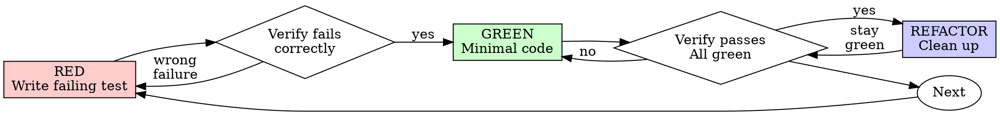

# Test-Driven Development (TDD)

## 概述

先写测试。看它失败。再写最小的代码让它通过。

**核心原则：** 如果你没亲眼看到测试失败过，你就不知道它测的到底是不是正确的东西。

**违反"条文"就是违反"精神"。** 别拿"我是在贯彻精神"来为跳过 TDD 找借口。

## 何时使用

**永远用：**
- 新 feature
- Bug 修复
- 重构
- 行为变更

**例外（先问人类）：**
- 一次性 prototype
- 生成的代码
- 纯配置文件

想着"就这一次跳过 TDD"？停。那是合理化（rationalization）。

## 铁律

```
NO PRODUCTION CODE WITHOUT A FAILING TEST FIRST
```

先写了代码再写测试？删掉。从头来。

**没有例外：**
- 不要"留作参考"
- 不要"边写测试边改写它"
- 不要看它
- 删就是删

从 test 出发重新实现。就这样。

## Red-Green-Refactor



### RED —— 写失败测试

写**一个**最小测试，描述想要的行为。

<Good>
```typescript
test('retries failed operations 3 times', async () => {
  let attempts = 0;
  const operation = () => {
    attempts++;
    if (attempts < 3) throw new Error('fail');
    return 'success';
  };

  const result = await retryOperation(operation);

  expect(result).toBe('success');
  expect(attempts).toBe(3);
});
```
名字清楚、测真实行为、只测一件事
</Good>

<Bad>
```typescript
test('retry works', async () => {
  const mock = jest.fn()
    .mockRejectedValueOnce(new Error())
    .mockRejectedValueOnce(new Error())
    .mockResolvedValueOnce('success');
  await retryOperation(mock);
  expect(mock).toHaveBeenCalledTimes(3);
});
```
名字模糊、测的是 mock 不是代码
</Bad>

**要求：**
- 一个行为
- 名字清楚
- 真代码（除非实在不得已，否则不 mock）

### Verify RED —— 亲眼看它失败

**强制。永远不能跳过。**

```bash
npm test path/to/test.test.ts
```

确认：
- test 是**失败**（不是 error）
- 失败信息就是你预期的
- 失败原因是**功能缺失**（不是 typo 之类）

**测试直接过了？** 说明你在测已有行为。修测试。

**测试报错了？** 修错误，重跑直到它正确地 fail。

### GREEN —— 最小实现

写**能让测试过的最简代码**。

<Good>
```typescript
async function retryOperation<T>(fn: () => Promise<T>): Promise<T> {
  for (let i = 0; i < 3; i++) {
    try {
      return await fn();
    } catch (e) {
      if (i === 2) throw e;
    }
  }
  throw new Error('unreachable');
}
```
刚刚好够过
</Good>

<Bad>
```typescript
async function retryOperation<T>(
  fn: () => Promise<T>,
  options?: {
    maxRetries?: number;
    backoff?: 'linear' | 'exponential';
    onRetry?: (attempt: number) => void;
  }
): Promise<T> {
  // YAGNI
}
```
过度设计
</Bad>

不要加额外 feature、不要重构其它代码、不要"顺手优化"。

### Verify GREEN —— 亲眼看它通过

**强制。**

```bash
npm test path/to/test.test.ts
```

确认：
- test 通过
- 其它 test 仍然通过
- 输出干净（无 error / warning）

**test 失败？** 修代码，不修测试。

**别的 test 挂了？** 现在就修。

### REFACTOR —— 清理

绿了之后再做：
- 去重
- 改好名字
- 抽出辅助函数

保持绿灯。不要在 refactor 阶段加新行为。

### Repeat

下一个失败测试对应下一个 feature。

## 好测试的特征

| 特性 | 好 | 坏 |
|---|---|---|
| **最小** | 只测一件事。名字里有"and"？拆开。 | `test('validates email and domain and whitespace')` |
| **清楚** | 名字描述行为 | `test('test1')` |
| **暴露意图** | 展示期望的 API | 模糊了代码应该做什么 |

## 为什么顺序很重要

**"我事后补测试来验证它工作"**

事后补的测试**立刻就过**。立刻就过证明不了什么：
- 可能测错了东西
- 可能测的是实现不是行为
- 可能漏了你忘掉的 edge case
- 你从没看到它抓到过 bug

先写测试强迫你**看着它失败**，证明它确实在测某个东西。

**"我已经手工测过所有 edge case 了"**

手工测试是临时的。你以为自己测了所有情况，但：
- 没有记录
- 代码改了没法回归
- 压力下容易漏
- "我试的时候它 work"≠ 系统验证

自动化测试是系统化的。每次都一样跑。

**"删掉 X 小时的工作太浪费"**

沉没成本谬误。时间已经花掉了。你现在的选择：
- 删掉用 TDD 重写（再 X 小时，高置信度）
- 留着事后补测试（30 分钟，低置信度，很可能有 bug）

"浪费"的是留下你不能信任的代码。没有真正测试的"能跑的代码"就是技术债。

**"TDD 太教条了，务实要灵活"**

TDD **就是**务实：
- commit 前就抓 bug（比事后调试快）
- 防回归（测试会立即抓到破坏）
- 记录行为（测试展示代码怎么用）
- 让重构变可能（改动自由，测试抓破坏）

"务实"捷径 = 生产环境调试 = 更慢。

**"Tests-after 达到的目标一样——是精神不是仪式"**

不。Tests-after 回答"这段代码在做什么？"Tests-first 回答"这段代码**应该**做什么？"

Tests-after 被你的实现偏置。你测你已经写了的东西，而不是"需求要求的东西"。你验证你**记得**的 edge case，而不是你**发现**的。

Tests-first 强迫你在实现之前发现 edge case。Tests-after 只验证你记全了（你肯定没记全）。

事后补 30 分钟测试 ≠ TDD。你得到覆盖率，但失去"测试有效"的证据。

## 常见合理化借口

| 借口 | 现实 |
|---|---|
| "太简单了不用测" | 简单代码也会坏。测试只需 30 秒。 |
| "我事后补" | 立刻通过的测试证明不了什么。 |
| "Tests-after 目标一样" | Tests-after = "这在做什么" / Tests-first = "这应该做什么" |
| "我已经手工测了" | 临时 ≠ 系统。没记录、没法回归。 |
| "删 X 小时太浪费" | 沉没成本。留着未验证代码才是债。 |
| "留作参考，我先写测试" | 你会去"借鉴它"。那就是 tests-after。删就是删。 |
| "我得先探索" | 可以。探索完**扔掉**，再从 TDD 开始。 |
| "难测 = 设计不清" | 听测试的话。难测就是难用。 |
| "TDD 会拖慢我" | TDD 比调试快。务实 = test-first。 |
| "手工更快" | 手工证明不了 edge case。每次改都要重测。 |
| "已有代码都没测试" | 你在改它。顺手给既有代码加测试。 |

## 红旗—— STOP 并从头来

- 先写代码再写测试
- test 在实现之后
- test 立刻就过
- 讲不清 test 为什么失败
- 测试"之后再加"
- 合理化"就这一次"
- "我已经手工测过了"
- "Tests-after 达到同样目的"
- "重在精神不在仪式"
- "留作参考"、"改一下既有代码"
- "已经花了 X 小时，删掉可惜"
- "TDD 太教条，我在务实"
- "这种情况不一样因为……"

**所有这些意味着：删掉代码。从 TDD 重来。**

## Example: Bug Fix

**Bug：** 空邮箱被接受

**RED**
```typescript
test('rejects empty email', async () => {
  const result = await submitForm({ email: '' });
  expect(result.error).toBe('Email required');
});
```

**Verify RED**
```bash
$ npm test
FAIL: expected 'Email required', got undefined
```

**GREEN**
```typescript
function submitForm(data: FormData) {
  if (!data.email?.trim()) {
    return { error: 'Email required' };
  }
  // ...
}
```

**Verify GREEN**
```bash
$ npm test
PASS
```

**REFACTOR**
多个字段都要校验时抽出 validation helper。

## 验证 checklist

work 标记为完成前：

- [ ] 每个新函数/方法都有测试
- [ ] 每个测试都**看过它失败**
- [ ] 失败原因是"feature 缺失"（不是 typo）
- [ ] GREEN 阶段只写了最小代码
- [ ] 全部 test pass
- [ ] 输出干净（无 error / warning）
- [ ] 测试用真实代码（mock 只在必要时）
- [ ] edge case 和 error 路径都覆盖

打不全勾？你跳过了 TDD。从头来。

## 卡住时

| 问题 | 解法 |
|---|---|
| 不知道怎么测 | 写你**希望的** API。先写 assertion。问人类。 |
| test 太复杂 | 设计太复杂。简化 interface。 |
| 什么都要 mock | 耦合太紧。用 dependency injection。 |
| setup 巨大 | 抽 helper。还是复杂？简化设计。 |

## 与调试的结合

发现 bug？**先写一个能复现 bug 的失败测试。** 跑 TDD 循环。这个测试既证明修好了，又防回归。

**永远不在没有测试的情况下修 bug。**

## 测试反模式

写测试或加 mock 时，参考 @testing-anti-patterns.md 避免这些常见坑：
- 测 mock 行为而不是真实行为
- 在生产代码里加"只给测试用"的方法
- 不理解依赖就 mock

## Final Rule

```
Production code → test exists and failed first
Otherwise → not TDD
```

除非用户明确授权，否则无例外。

## 与 MCC 生态的关系

- **这是 `/mcc:tdd` 命令的 skill 实现。** 命令入口只做参数传递和跑测试命令；方法论、铁律、红旗、合理化借口表都在这里。
- `tdd-guide` agent：想要一位"专注 TDD 纪律"的 subagent 来引导过程时派他。
- `/mcc:implement` 或 `subagent-driven-development`：在 implementer subagent 的 prompt 里明确要求遵循本 skill。
- `verification-loop` skill：每个 feature 完成后，按本 skill 保证测试覆盖；再进 verification-loop 做集成校验。
- `confidence-check` skill：动手前先跑一次 confidence-check，过 90% 再进入本 skill 的 RED 阶段。
