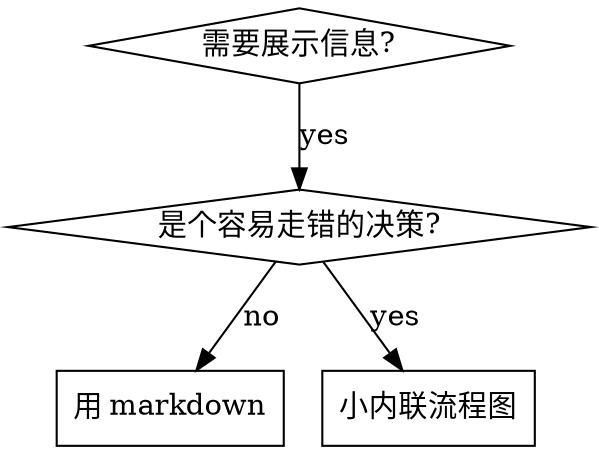

# Writing Skills

## 概述

**写 skill 就是把 TDD 应用到流程文档。**

你写 test case（用 subagent 跑**压力场景**）、看 baseline 失败（没有 skill 时的自然行为）、写出 skill（文档）、看 test 通过（agent 合规）、再 refactor（堵合理化借口）。

**核心原则：** 如果你没看过 agent 在"没 skill"的情况下失败，你就不知道这个 skill 到底在教什么有用的东西。

**产出位置：**
- 个人/项目 skill：`~/.claude/skills/` 或项目 `.claude/skills/`
- MCC 官方源：`mcc-build/final/source/skills/{name}/SKILL.md`（kebab-case 目录，`SKILL.md` 大写文件名）

**前置阅读：** 使用本 skill 前你**必须**理解 `tdd-workflow`——它定义了 RED-GREEN-REFACTOR 基础循环。本 skill 是把那套循环搬到文档上。

**官方指引：** Anthropic 官方的 skill 撰写最佳实践参见本目录 `anthropic-best-practices.md`——和本 skill 的 TDD 取向互补。

## 什么是 skill

**skill** 是经过验证的技术、模式或工具的参考指南。帮助未来的 Claude 实例**找到**并**应用**有效方法。

**Skill 是：** 可复用的技术、模式、工具、参考指南

**Skill 不是：** 讲"你有一次怎么解决了一个问题"的叙事

## TDD 到 Skill 的映射

| TDD 概念 | 对应的 Skill 环节 |
|---|---|
| Test case | 给 subagent 的压力场景 |
| 生产代码 | skill 文档（SKILL.md） |
| Test fails (RED) | 没有 skill 时 agent 违反规则（baseline） |
| Test passes (GREEN) | 有 skill 时 agent 合规 |
| Refactor | 在保持合规的前提下堵漏洞 |
| 先写 test | 写 skill **之前**先跑 baseline 场景 |
| 看它失败 | 记录 agent 实际用的**原话**合理化借口 |
| 最小代码 | 针对这些具体违规写 skill |
| 看它通过 | 确认 agent 现在会合规 |
| Refactor 循环 | 发现新借口 → 堵 → 再验证 |

整个 skill 创建过程就是 RED-GREEN-REFACTOR。

## 何时创建 Skill

**创建 when：**
- 这个技术对你来说不是一看就懂的
- 你未来会跨项目再用
- 模式有广泛适用性（不是某项目独有）
- 别人也会受益

**不要为以下情况创建：**
- 一次性解决方案
- 其它地方已有充分文档的标准做法
- 项目特定约定（放 `CLAUDE.md`）
- 可以用 regex/校验自动化强制的机械约束（能自动化就自动化，文档留给需要判断的场景）

## Skill 类型

### Technique（技术）
具体方法 + 步骤（例：`condition-based-waiting`、`root-cause-tracing`）

### Pattern（模式）
思考问题的方式（例：`flatten-with-flags`、`test-invariants`）

### Reference（参考）
API 文档、语法指南、工具文档

## 目录结构

```
skills/
  skill-name/
    SKILL.md              # 主参考（必需）
    supporting-file.*     # 仅在必要时添加
```

**扁平命名空间** —— 所有 skill 在一个可搜索的命名空间里

**需要独立文件的情况：**
1. **重型参考**（100+ 行）—— API 文档、完整语法
2. **可复用工具** —— 脚本、工具、模板

**内联（inline）就够的：**
- 原则和概念
- 代码模式（< 50 行）
- 其它一切

## SKILL.md 结构

**Frontmatter（YAML）：**
- 两个必需字段：`name` 和 `description`
- 总长 ≤ 1024 字符
- `name`：只用字母、数字、连字符（不要括号和特殊字符）
- `description`：第三人称，**只**描述"何时用"（不描述"做什么"）
  - 以"用于……时"或"Use when..."开头，聚焦触发条件
  - 包含具体症状、情境、上下文
  - **永远不要在 description 里总结 skill 的流程或 workflow**（见下文 CSO 章节，有血的教训）
  - 尽量 ≤ 500 字符

```markdown
---
name: Skill-Name-With-Hyphens
description: 用于 [具体触发条件和症状] 时
---

# Skill Name

## 概述
这是什么？核心原则 1-2 句话。

## 何时使用
[如果决策点不显然，放一个小内联流程图]

症状和用例列表
什么时候**不要**用

## 核心模式（如果是 technique/pattern）
Before/after 代码对比

## 速查
表或 bullet，方便扫描

## 实现
简单模式 inline，重型参考或工具外挂文件

## 常见错误
哪里会出错 + 修正

## 实际影响（可选）
具体结果
```

## Claude Search Optimization (CSO)

**对发现至关重要：** 未来的 Claude 要能**找到**你的 skill。

### 1. 丰富的 description 字段

**用途：** Claude 靠 description 决定"这个任务要不要加载这个 skill"。它必须回答："我现在要不要读这个 skill？"

**格式：** 以"Use when..."或中文"用于……时"开头，聚焦触发条件。

**CRITICAL：description = 何时使用，而非 skill 做了什么**

description 应该**只**描述触发条件。**不要**在 description 里总结 skill 的流程或 workflow。

**为什么：** 实测发现，当 description 总结了 workflow，Claude 可能**按 description 走**而不是读 skill 全文。某个 description 说"executing plans 间做 code review"，Claude 就只做一轮 review，虽然 skill 流程图明明画了**两轮**（spec compliance 然后 code quality）。

当 description 改成仅 "Use when executing implementation plans with independent tasks"（不提 workflow）后，Claude 才正确读了流程图、跑了两阶段 review。

**陷阱：** 总结 workflow 的 description 给 Claude 造了一条捷径，skill 正文就变成"它会跳过的文档"。

```yaml
# ❌ BAD: 总结 workflow —— Claude 可能照这个走而不读 skill
description: Use when executing plans - dispatches subagent per task with code review between tasks

# ❌ BAD: 流程细节太多
description: Use for TDD - write test first, watch it fail, write minimal code, refactor

# ✅ GOOD: 只有触发条件
description: Use when executing implementation plans with independent tasks in the current session

# ✅ GOOD: 只有触发条件
description: Use when implementing any feature or bugfix, before writing implementation code
```

**内容：**
- 用具体的 trigger、症状、情境表示"这个 skill 适用"
- 描述**问题**（race condition、行为不一致），不是**语言特定症状**（setTimeout、sleep）
- 除非 skill 本身与技术绑定，否则 trigger 保持技术无关
- 如果 skill 是技术特定的，在 trigger 里明确写出来
- 第三人称（会被注入到 system prompt）
- **永远不要**总结 skill 的流程或 workflow

```yaml
# ❌ BAD: 太抽象、太模糊、没写"何时用"
description: For async testing

# ❌ BAD: 第一人称
description: I can help you with async tests when they're flaky

# ❌ BAD: 提了具体技术但 skill 并不特定于此
description: Use when tests use setTimeout/sleep and are flaky

# ✅ GOOD: 以"Use when"开头，描述问题，无 workflow
description: Use when tests have race conditions, timing dependencies, or pass/fail inconsistently

# ✅ GOOD: 技术特定 skill，trigger 明确
description: Use when using React Router and handling authentication redirects
```

### 2. 关键词覆盖

用 Claude 会搜的词：
- 错误消息："Hook timed out"、"ENOTEMPTY"、"race condition"
- 症状："flaky"、"hanging"、"zombie"、"pollution"
- 近义词："timeout/hang/freeze"、"cleanup/teardown/afterEach"
- 工具：实际的命令、库名、文件类型

### 3. 描述性命名

**主动语态、动词在前：**
- ✅ `creating-skills`，不 `skill-creation`
- ✅ `condition-based-waiting`，不 `async-test-helpers`

### 4. Token 效率（关键）

**问题：** getting-started 和高频引用的 skill 会被加载到**每次会话**里。每个 token 都算钱。

**目标字数：**
- getting-started 型工作流：每个 <150 词
- 高频加载型 skill：总 <200 词
- 其它 skill：<500 词（仍要简洁）

**技巧：**

**把细节移到工具 help：**
```bash
# ❌ BAD: 在 SKILL.md 里列所有 flag
search-conversations supports --text, --both, --after DATE, --before DATE, --limit N

# ✅ GOOD: 引导去看 --help
search-conversations supports multiple modes and filters. Run --help for details.
```

**用交叉引用：**
```markdown
# ❌ BAD: 重复 workflow 细节
When searching, dispatch subagent with template...
[20 行重复指令]

# ✅ GOOD: 引用其它 skill
Always use subagents (50-100x context savings). REQUIRED: Use [other-skill-name] for workflow.
```

**压缩 example：**
```markdown
# ❌ BAD: 冗长（42 词）
User: "How did we handle authentication errors in React Router before?"
You: I'll search past conversations for React Router authentication patterns.
[Dispatch subagent with search query: "React Router authentication error handling 401"]

# ✅ GOOD: 最小化（20 词）
User: "How did we handle auth errors in React Router?"
You: Searching...
[Dispatch subagent → synthesis]
```

**消除重复：**
- 不要重复其它 skill 的内容
- 不要解释命令里一目了然的东西
- 不要给同一模式放多个 example

**验证：**
```bash
wc -w skills/path/SKILL.md
# getting-started 工作流：每个 <150
# 其它高频加载：<200
```

**按"你做什么"或"核心洞察"命名：**
- ✅ `condition-based-waiting` > `async-test-helpers`
- ✅ `using-skills`，不 `skill-usage`
- ✅ `flatten-with-flags` > `data-structure-refactoring`
- ✅ `root-cause-tracing` > `debugging-techniques`

**动名词（-ing）适合过程：**
- `creating-skills`、`testing-skills`、`debugging-with-logs`
- 主动、描述你在做什么

### 5. 交叉引用其它 skill

**写引用其它 skill 的文档时：**

只用 skill 名，用明确的"必需"标记：
- ✅ 好：`**REQUIRED SUB-SKILL:** Use tdd-workflow`
- ✅ 好：`**REQUIRED BACKGROUND:** You MUST understand systematic-debugging`
- ❌ 坏：`See skills/testing/test-driven-development`（不清楚是否必需）
- ❌ 坏：`@skills/testing/test-driven-development/SKILL.md`（强制加载，烧 context）

**为什么不用 @：** `@` 语法**立即**强制加载文件，在你还没用到之前就消耗 200k+ context。

## 流程图用法



**仅用流程图于：**
- 不明显的决策点
- 可能过早停止的循环流程
- "A 还是 B"的决策

**不要用流程图于：**
- 参考资料 → 用表或列表
- 代码示例 → 用 markdown 代码块
- 线性指令 → 用编号列表
- 没有语义的 label（step1、helper2）

## 代码示例

**一个极好的例子胜过多个平庸的**

选最相关的语言：
- 测试技术 → TypeScript/JavaScript
- 系统调试 → Shell/Python
- 数据处理 → Python

**好 example：**
- 完整、可运行
- 注释解释**为什么**（不是**做什么**）
- 来自真实场景
- 清楚展示模式
- 可直接改用（不是填空模板）

**不要：**
- 用 5 种语言分别实现
- 写填空模板
- 凑假例子

你移植能力没问题 —— 一个好例子足够。

## 文件组织

### 自包含 skill
```
defense-in-depth/
  SKILL.md    # 全部 inline
```
何时：全部内容能放下、不需要重型参考。

### Skill 加可复用工具
```
condition-based-waiting/
  SKILL.md    # 概述 + 模式
  example.ts  # 可改用的 helper
```
何时：工具是可复用代码，不是叙事。

### Skill 加重型参考
```
pptx/
  SKILL.md       # 概述 + workflow
  pptxgenjs.md   # 600 行 API 参考
  ooxml.md       # 500 行 XML 结构
  scripts/       # 可执行工具
```
何时：参考资料太大，inline 放不下。

## 铁律（与 TDD 一致）

```
NO SKILL WITHOUT A FAILING TEST FIRST
```

对**新 skill** 和**编辑已有 skill** 都适用。

没测就写了 skill？删掉。从头来。
没测就改了 skill？同样违规。

**没有例外：**
- "只是简单补充" —— 不行
- "只是加一段" —— 不行
- "只是文档更新" —— 不行
- 不要"留下未测试的改动作参考"
- 不要"边测边改它"
- 删就是删

**前置阅读：** `tdd-workflow` 解释了为什么这很重要。同样的原则应用到文档。

## 测试不同类型的 skill

不同类型 skill 需要不同测试方法：

### 纪律型 skill（规则/要求）

**例子：** TDD、verification-before-completion、designing-before-coding

**怎么测：**
- 学术题：他们理解规则吗？
- 压力场景：在压力下还遵守吗？
- 多重压力叠加：时间 + 沉没成本 + 疲劳
- 识别合理化借口并加明确反制

**成功标准：** agent 在最大压力下仍遵守规则

### 技术型 skill（how-to）

**例子：** condition-based-waiting、root-cause-tracing、defensive-programming

**怎么测：**
- 应用场景：能正确应用这个技术吗？
- 变体场景：能处理 edge case 吗？
- 缺信息场景：指令有 gap 吗？

**成功标准：** agent 能把技术成功应用到新场景

### 模式型 skill（心智模型）

**例子：** reducing-complexity、information-hiding

**怎么测：**
- 识别场景：能认出何时适用？
- 应用场景：能用上这个心智模型？
- 反例：知道**何时不要**应用？

**成功标准：** agent 能正确判断何时/如何应用

### 参考型 skill（文档/API）

**例子：** API 文档、命令参考、库指南

**怎么测：**
- 检索场景：能找到正确信息？
- 应用场景：能正确使用找到的东西？
- Gap 测试：常用场景都覆盖了吗？

**成功标准：** agent 找到并正确应用参考信息

## 跳过测试的常见合理化

| 借口 | 现实 |
|---|---|
| "Skill 显然很清楚" | 对你清楚 ≠ 对其它 agent 清楚。测。 |
| "只是参考" | 参考也会有 gap 和不清楚的段。测检索。 |
| "测试太 overkill" | 未测试的 skill 必有问题。15 分钟测省几小时 debug。 |
| "有问题再说" | "有问题"= agent 用不了你的 skill。部署前测。 |
| "测试太繁琐" | 测试比 debug 一个烂 skill 省事。 |
| "我有信心它 OK" | 过度自信保证有问题。照样测。 |
| "学术审阅就够了" | 读 ≠ 用。测应用场景。 |
| "没时间测" | 部署未测 skill 之后花的时间更多。 |

**所有这些意味着：部署前测。无例外。**

## 防合理化武装

强制纪律的 skill（例如 TDD）必须抗合理化。Agent 很聪明，在压力下会找漏洞。

### 明确堵每个漏洞

不要只说规则——**明确禁止**每一个 workaround：

<Bad>
```markdown
先写代码再写测试？删掉。
```
</Bad>

<Good>
```markdown
先写代码再写测试？删掉。从头来。

**没有例外：**
- 不要"留作参考"
- 不要"边写测试边改写它"
- 不要看它
- 删就是删
```
</Good>

### 对付"精神 vs 条文"的争辩

早早放一条基础原则：

```markdown
**违反条文就是违反精神。**
```

这一刀下去，一整类"我是在贯彻精神"的合理化就断了。

### 建合理化对照表

从 baseline 测试采集合理化借口。每一条借口都进表：

```markdown
| 借口 | 现实 |
|---|---|
| "太简单了不用测" | 简单代码也会坏。测试 30 秒就写完。 |
| "我事后补" | 立刻通过的测试什么都证明不了。 |
| "Tests-after 达到同样目标" | Tests-after = "这在做什么" / Tests-first = "这应该做什么" |
```

### 建红旗清单

方便 agent 自检：

```markdown
## 红旗 — STOP 并从头来

- 先写代码再写测试
- "我已经手工测过了"
- "Tests-after 达到同样目的"
- "重在精神不在仪式"
- "这种情况不一样因为……"

**所有这些意味着：删掉代码。从 TDD 重来。**
```

### 更新 CSO 以包含违规症状

把"**即将**违反规则"的症状写进 description：

```yaml
description: 用于实现任何 feature 或 bugfix 之前
```

## 对 Skill 做 RED-GREEN-REFACTOR

### RED：写失败的测试（baseline）

**不加载 skill**，用 subagent 跑压力场景。记录准确行为：
- 他们做了什么选择？
- 用了哪些合理化借口（**原话**）？
- 哪些压力触发了违规？

这就是"看测试失败"——你必须先看 agent 在没你这个 skill 的自然状态下会怎么做。

### GREEN：写最小 skill

写出**针对那些具体借口**的 skill。不要为假想情况加内容。

同样场景再跑一遍——这次**加载 skill**。agent 应该合规了。

### REFACTOR：堵漏洞

Agent 又找到新借口？加明确反制。再跑，直到攻不破。

## 反模式

### ❌ 叙事例子
"2025-10-03 那次 session，我们发现空 projectDir 导致……"
**为什么坏：** 太具体，不可复用。

### ❌ 多语言稀释
example-js.js、example-py.py、example-go.go
**为什么坏：** 每个都平庸，维护负担大。

### ❌ 流程图里塞代码
```dot
step1 [label="import fs"];
step2 [label="read file"];
```
**为什么坏：** 不能复制粘贴，难读。

### ❌ 无语义 label
helper1、helper2、step3、pattern4
**为什么坏：** label 要有语义。

## STOP：写完一个 skill 必须停一下

**写完任何 skill 之后必须 STOP，完成部署流程。**

**不要：**
- 批量写多个 skill 而不逐个测试
- 当前这个没验证就去下一个
- 因为"批处理效率高"就跳过测试

**每个 skill 的部署 checklist 都是强制的。**

部署未测试的 skill = 部署未测试的代码。违反质量标准。

## Skill 创建 Checklist（TDD 版）

**重要：** 把下面每项都用 TodoWrite 建成一条 todo。

**RED 阶段 —— 写失败测试：**
- [ ] 创建压力场景（纪律型 skill 要 3+ 种压力组合）
- [ ] **不加 skill** 跑场景 —— 逐字记录 baseline 行为
- [ ] 识别合理化借口/失败模式

**GREEN 阶段 —— 写最小 skill：**
- [ ] name 只含字母、数字、连字符
- [ ] YAML frontmatter 有必需的 `name` 和 `description`（≤ 1024 字符）
- [ ] description 以"Use when..."或"用于……时"开头，含具体 trigger/症状
- [ ] description 第三人称
- [ ] 全文分布关键词（错误、症状、工具）
- [ ] 核心原则 overview 清楚
- [ ] 针对 RED 发现的具体 baseline 失败
- [ ] 代码内联或链接到独立文件
- [ ] 一个极好的 example（不多语言）
- [ ] **加载 skill** 跑场景 —— 确认 agent 合规

**REFACTOR 阶段 —— 堵漏洞：**
- [ ] 识别测试中出现的**新**合理化
- [ ] 加明确反制（如果是纪律型 skill）
- [ ] 从全部迭代里汇总合理化对照表
- [ ] 做红旗清单
- [ ] 再跑，直到攻不破

**质量检查：**
- [ ] 只在决策非显然时放流程图
- [ ] 有速查表
- [ ] 有"常见错误"段
- [ ] 无叙事讲故事
- [ ] 配套文件只给工具或重型参考用

**部署：**
- [ ] 提交到 git
- [ ] 有广泛价值的考虑贡献回上游（如果有上游）

## 发现流程

未来的 Claude 如何找到你的 skill：

1. **遇到问题**（"测试 flaky"）
2. **找到 SKILL**（description 匹配）
3. **扫 overview**（是不是相关？）
4. **读模式**（速查表）
5. **加载 example**（实现时才看）

**围绕这个流程优化** —— 把可搜索词早早且反复放进去。

## 底线

**写 skill 就是给流程文档做 TDD。**

同样的铁律：没失败测试就没 skill。
同样的循环：RED（baseline）→ GREEN（写 skill）→ REFACTOR（堵漏洞）。
同样的收益：更好的质量、更少意外、防弹结果。

你对代码用 TDD，就对 skill 也用 TDD。同样的纪律，套到文档上。

## 与 MCC 生态的配合

- `tdd-workflow` —— 方法论基础。先读懂那个，再用本 skill。
- `anthropic-best-practices.md`（本目录）—— Anthropic 官方 skill 撰写指引，作为本 skill 的补充参考。
- `continuous-learning-v2` —— hooks 后台观察得到的 instinct，通过 `/evolve` 可以提升为完整 skill，这时用本 skill 编辑产出。
- `/learn` 命令 —— 显式从单次会话提炼 pattern 成 skill，产出用本 skill 校验。
- 产出位置：个人写入 `~/.claude/skills/`，项目写入 `.claude/skills/`，贡献到 MCC 时写入 `mcc-build/final/source/skills/{name}/SKILL.md`。
